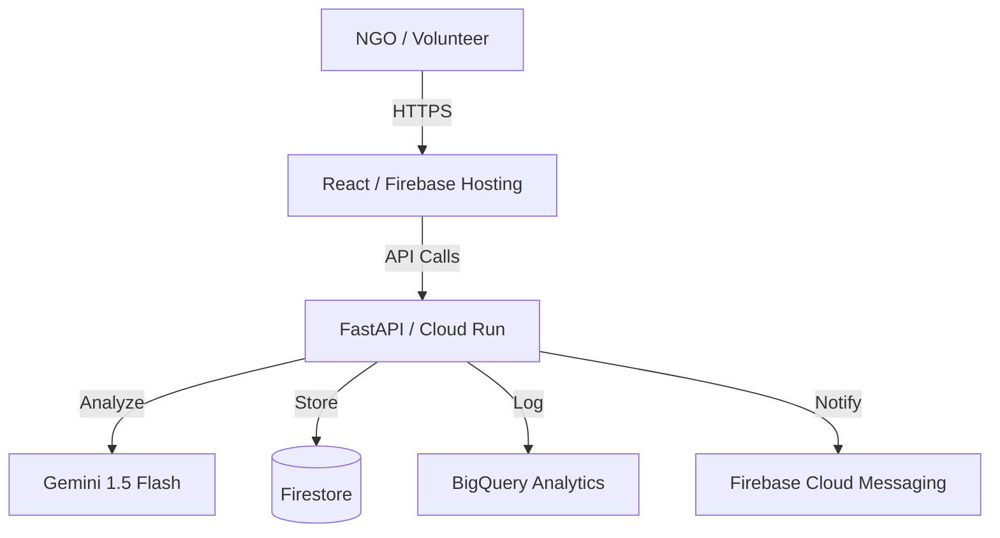

# SVAS: Smart Volunteer Allocation System 🤝🤖

[](https://deepmind.google/technologies/gemini/)
[](https://fastapi.tiangolo.com/)
[](https://react.dev/)

**SVAS** is an AI-powered cloud platform designed to streamline NGO operations by centralizing community data, detecting urgent needs using Generative AI (Gemini), and intelligently matching volunteers to tasks based on location and skills.

---

## 🚀 Key Features

- 📄 **Smart Data Ingestion**: Upload CSV, JSON, or images (OCR) to centralize community reports.
- 🧠 **AI Need Analysis**: Uses **Gemini 1.5 Flash** to categorize needs (Food, Health, etc.) and assign urgency levels.
- 📍 **Intelligent Matching**: Algorithm-driven volunteer assignment based on proximity and skill set.
- 📊 **Real-time Dashboard**: Interactive heatmaps and visualization of community needs and task completion.
- 🔔 **Instant Notifications**: Firebase Cloud Messaging (FCM) for task alerts and urgent reminders.

---

## 🛠️ Tech Stack

### Backend
- **Core**: Python 3.10+, FastAPI
- **Cloud**: Google Cloud Run
- **AI**: Google Gemini 1.5 Flash
- **Database**: Firebase Firestore
- **Analytics**: Google BigQuery

### Frontend
- **Framework**: React 19 (Vite)
- **Styling**: Vanilla CSS (Premium Design System)
- **Icons**: Lucide React
- **Auth**: Firebase Authentication

---

## 🏁 Getting Started

### Prerequisites
- Node.js (v18+)
- Python (v3.10+)
- Firebase Project
- Google Cloud Project with Gemini API enabled

### 1. Backend Setup
```bash
# From the repo root
cd backend

# Create virtual environment
python -m venv venv
# Windows PowerShell
.\\venv\\Scripts\\Activate.ps1
# Or Windows cmd
# venv\\Scripts\\activate
# macOS / Linux
# source venv/bin/activate

# Install dependencies
pip install -r requirements.txt

# Create .env file from example
cp .env.example .env

# Run locally
python -m app.main
```

### 2. Frontend Setup
```bash
# From the repo root
cd frontend

# Install dependencies
npm install

# Create .env file and add your Firebase values

# Run development server
npm run dev
```

### 3. Open The App
- Frontend: `http://localhost:5173`
- Backend: `http://localhost:8080`

---

## ⚙️ Environment Variables

### Backend (`backend/.env`)
| Variable | Description |
|----------|-------------|
| `GOOGLE_CLOUD_PROJECT` | Google Cloud project ID |
| `FIREBASE_SERVICE_ACCOUNT_KEY` | Path to the Firebase service account JSON |
| `GEMINI_API_KEY` | Gemini API key |
| `ALLOWED_ORIGINS` | Comma-separated or JSON list of frontend origins |
| `PORT` | Backend port, default `8080` |

### Frontend (`frontend/.env`)
| Variable | Description |
|----------|-------------|
| `VITE_API_BASE_URL` | Backend API URL, usually `http://localhost:8080` |
| `VITE_FIREBASE_API_KEY` | Firebase web API key |
| `VITE_FIREBASE_AUTH_DOMAIN` | Firebase auth domain |
| `VITE_FIREBASE_PROJECT_ID` | Firebase project ID |
| `VITE_FIREBASE_STORAGE_BUCKET` | Firebase storage bucket |
| `VITE_FIREBASE_MESSAGING_SENDER_ID` | Firebase messaging sender ID |
| `VITE_FIREBASE_APP_ID` | Firebase app ID |
| `VITE_FIREBASE_VAPID_KEY` | Firebase Cloud Messaging VAPID key |
| `VITE_APP_ENV` | Usually `development` for local runs |

---

## 🏗️ Architecture



---

## 📄 License
This project is licensed under the MIT License.
